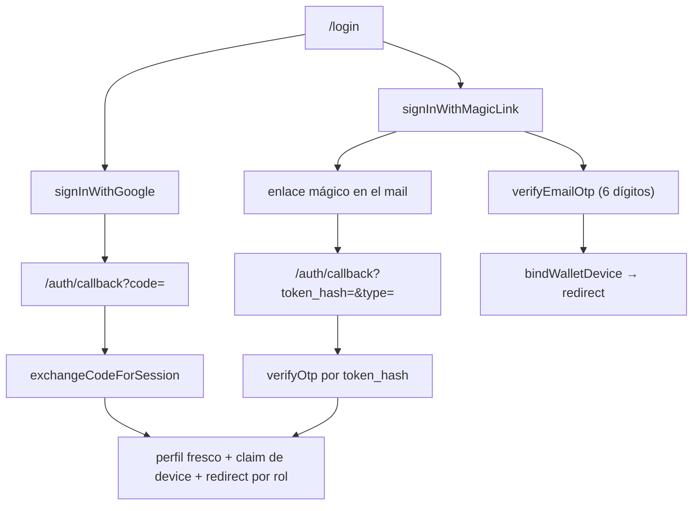

# Autenticación y sesiones

Sistema de identidad de TokePass: el flujo dual de Google OAuth y código OTP de 6 dígitos por
correo, cómo se destruyen las cookies de sesión para no dejar estados zombie, y qué bloquea el
interceptor Edge en cada request.

> **El archivo no se llama `middleware.ts`.** En Next.js 16 el interceptor Edge pasó a llamarse
> `proxy.ts` y exporta `proxy()` en lugar de `middleware()`. El propio archivo lo advierte: *"Do
> not add a sibling middleware.ts — the build rejects both."* Si buscás `middleware.ts` en la raíz
> no existe; lo que sí existe es `lib/supabase/middleware.ts`, que es la **implementación** de
> refresco de sesión que el proxy invoca.

## Índice

1. [Anatomía del sistema](#1-anatomía-del-sistema)
2. [El interceptor Edge](#2-el-interceptor-edge)
3. [Qué rutas están bloqueadas](#3-qué-rutas-están-bloqueadas)
4. [El flujo dual: Google y OTP](#4-el-flujo-dual-google-y-otp)
5. [Convergencia en `/auth/callback`](#5-convergencia-en-authcallback)
6. [Destrucción de sesión: las tres capas anti-zombie](#6-destrucción-de-sesión-las-tres-capas-anti-zombie)
7. [Vinculación de dispositivo y AAL2](#7-vinculación-de-dispositivo-y-aal2)
8. [Roles y destinos post-login](#8-roles-y-destinos-post-login)
9. [Deuda y riesgos verificados](#9-deuda-y-riesgos-verificados)

---

## 1. Anatomía del sistema

### 1.1 Archivos por responsabilidad

| Archivo | Responsabilidad |
| --- | --- |
| `proxy.ts` | Interceptor Edge de Next.js 16. Tres líneas: delega en `handleEdgeRequest`. |
| `lib/edge/handle-request.ts` | Orquesta el pipeline Edge: bypass, rate limit, sala de espera, sesión. |
| `lib/supabase/middleware.ts` | `updateSession`: CSP, referidos, redirecciones legacy, purga de cookies, refresco de sesión y control de acceso por rol. |
| `app/actions/auth.ts` | Server Actions de login, OTP, OAuth y logout. |
| `app/auth/callback/route.ts` | Punto de convergencia: intercambio PKCE y verificación de token de email. |
| `components/shared/auth-forms.tsx` | La UI de login (Google + email + OTP) en un solo componente cliente. |
| `lib/auth/session-cookies.ts` | Predicados puros: qué cookie es de auth, cuándo purgar. |
| `lib/auth/clear-auth-cookies.ts` | Borrado server-side de cookies de sesión. |
| `lib/session-cleanup.ts` | Borrado client-side: cookies, IndexedDB, service worker, caches. |
| `lib/auth/next-path.ts` | Anti open-redirect y destinos por rol. |
| `lib/auth/request-path.ts` | Lee la ruta actual del header `x-pathname` para los guards de layout. |
| `lib/auth/callback-url.ts` | Allowlist de orígenes y cookie `next`. |
| `lib/auth/post-login.ts` | Lee el rol **desde Postgres**, no del JWT. |
| `lib/auth/wallet-device.ts` + `wallet-device-server.ts` | Vinculación de dispositivo para el QR vivo. |
| `types/auth.ts` | Roles de staff por evento y allowlist de rutas operativas. |

### 1.2 Los tres principios

1. **Passwordless para compradores, contraseña para organizadores.** El público entra con Google o
   con un código de 6 dígitos; el panel de organizador usa email + contraseña. Son dos superficies
   distintas (`/login` y `/login-organizador`).
2. **El rol se lee de Postgres, nunca del JWT.** El comentario en `post-login.ts` es explícito:
   *"The access token is used only to identify the authenticated user; JWT claims never decide the
   post-login destination."* Un token viejo con un rol elevado no sirve de nada.
3. **Ante la duda, destruir la sesión.** Cada camino de fallo llama a `destroyAuthSession()`, y esa
   función borra cookies **incluso si el `signOut` de Supabase falla**. Es la defensa central
   contra estados zombie.

---

## 2. El interceptor Edge

### 2.1 `proxy.ts` en su totalidad

```ts
// proxy.ts
/**
 * Next.js 16 Edge interceptor (formerly middleware.ts).
 * Runtime is Edge. Do not add a sibling middleware.ts — the build rejects both.
 * Session refresh lives here via `updateSession` → `supabase.auth.getUser()`.
 */
export async function proxy(request: NextRequest) {
  return handleEdgeRequest(request)
}

export const config = {
  matcher: [
    "/((?!_next/static|_next/image|favicon.ico|.*\\.(?:svg|png|jpg|jpeg|gif|webp)$).*)",
  ],
}
```

El matcher corre en **todo** salvo estáticos e imágenes. Eso incluye páginas, rutas de API y POSTs
de Server Actions.

### 2.2 El pipeline, en orden

```ts
// lib/edge/handle-request.ts
export async function handleEdgeRequest(request: NextRequest) {
  const { pathname } = request.nextUrl

  if (isAuthRefreshBypassPath(pathname)) {
    return passthroughWithCsp(request)
  }

  if (await edgeCheckoutIpBlocked(request)) {
    return NextResponse.json(
      { success: false, error: EDGE_CHECKOUT_RATE_LIMIT_ERROR },
      { status: 429 },
    )
  }

  const gate = await evaluateWaitingRoomGate(request)
  if (gate.kind === "block") return gate.response

  const response = await updateSession(request)
  if (gate.kind === "admit") {
    applyVipCookie(response, gate.cookie)
  }
  return response
}
```

**El bypass es lo más importante de leer acá.** `isAuthRefreshBypassPath` devuelve true para
`/auth/callback` y para las rutas de la sala de espera:

```ts
// lib/waiting-room/paths.ts (29–34)
export function isAuthRefreshBypassPath(pathname: string): boolean {
  if (pathname === "/auth/callback" || pathname.startsWith("/auth/callback/")) {
    return true
  }
  return isWaitingRoomBypassPath(pathname)
}
```

El callback **no pasa por `updateSession`**. Si pasara, el `supabase.auth.getUser()` del middleware
correría en paralelo con el `exchangeCodeForSession` del handler, ambos escribiendo cookies de
sesión sobre la misma respuesta: una carrera que puede dejar la sesión a medio establecer. Saltear
el refresco en esa ruta es lo que hace el intercambio determinista.

### 2.3 Qué hace `updateSession`, en orden

1. **Nonce CSP** — `createCspNonce()` por request, inyectado como header `x-nonce` y en el header
   `Content-Security-Policy`. Cada respuesta lleva su propia política.
2. **Captura de referidos** — lee `?rrpp=` o `?ref=` y los persiste en dos cookies
   (`REFERRAL_COOKIE_NAME`, `RRPP_COOKIE_NAME`). Sucede antes de cualquier autenticación: el
   crédito del promotor sobrevive al login.
3. **Redirecciones legacy 308** — `/my-tickets`, `/mis-tickets`, `/my-orders`, `/profile` y sus
   subrutas hacia el portal `/cuenta/*`.
4. **Purga de cookies por error de login** — ver [sección 6.2](#62-capa-2-el-interceptor-edge).
5. **Refresco de sesión** — `supabase.auth.getUser()`, con un comentario que vale la pena citar:

   ```ts
   // getUser validates the token with Supabase Auth; getSession alone does not.
   ```

   Es la diferencia entre validar el token contra el servidor de Auth y limitarse a decodificar lo
   que trae la cookie. El interceptor usa la primera.
6. **Control de acceso por rol** — ver sección 3.

Un detalle de implementación que importa: cuando Supabase rota los tokens, el callback `setAll`
**reconstruye la respuesta desde cero** (`createPassthroughResponse` + `captureReferralFromRequest`)
para que las cookies nuevas convivan con el nonce y con el referido. Y si hay que redirigir,
`redirectWithRefreshedCookies` copia todas las cookies acumuladas a la respuesta de redirección:
sin eso, un refresh de token que coincide con un redirect perdería la sesión recién renovada.

---

## 3. Qué rutas están bloqueadas

### 3.1 La respuesta corta: las públicas no están bloqueadas por rol

El interceptor **no tiene allowlist de rutas públicas**. El modelo es el inverso: todo es público
salvo cuatro familias explícitas.

```ts
// lib/supabase/middleware.ts (183–190)
const isAdminRoute = pathname.startsWith("/admin")
const isSuperAdminRoute =
  pathname.startsWith("/superadmin") || pathname.startsWith("/super-admin")
const isPosRoute = isPosOpsPath(pathname)
const isRrppRoute = pathname === "/rrpp" || pathname.startsWith("/rrpp/")
const isPromoterRoute = pathname.startsWith("/promoter") || isRrppRoute
const isProtectedRoute =
  isAdminRoute || isSuperAdminRoute || isPromoterRoute || isPosRoute
```

| Familia | Prefijos | Sin sesión redirige a |
| --- | --- | --- |
| Panel de organizador | `/admin/*` | `/login-organizador?next=…` |
| Panel de plataforma | `/superadmin/*`, `/super-admin/*` | `/login-organizador?next=…` |
| Promotores / RRPP | `/promoter/*`, `/rrpp`, `/rrpp/*` | `/login?next=…` |
| Punto de venta | `/admin/pos`, `/dashboard/pos` | `/login-organizador?next=…` |

Notá la bifurcación del destino: los promotores van al login de compradores (son usuarios
passwordless), el resto al login de organizadores. Y el `next` preserva el querystring completo
(`${pathname}${request.nextUrl.search}`).

### 3.2 Con sesión: tres compuertas de rol

**Panel de plataforma, exclusivo de `super_admin`:**

```ts
// lib/supabase/middleware.ts (209–215)
// The platform panel is exclusive to super admins.
if (isSuperAdminRoute && role !== "super_admin") {
  const fallbackUrl = request.nextUrl.clone()
  fallbackUrl.pathname = role === "admin" ? "/admin" : "/"
  fallbackUrl.search = ""
  return redirectWithRefreshedCookies(fallbackUrl, response, nonce, request)
}
```

**Punto de venta:** admite `admin`, `super_admin` o quien tenga una asignación de staff con rol de
caja.

**`/admin/*` para staff de evento:** un `door_staff` no es admin, pero necesita entrar al escáner.
La solución es una allowlist de rutas operativas cruzada con los roles asignados:

```ts
// lib/supabase/middleware.ts (246–265)
if (isAdminRoute && role !== "admin" && role !== "super_admin") {
  const staffRoles = await loadStaffRoles()

  if (staffRoles.length === 0) {
    // fuera del panel: a la home
  }

  if (
    !isStaffOpsPath(pathname) ||
    !staffCanAccessPath(pathname, staffRoles)
  ) {
    // a su home de staff
  }
}
```

Las asignaciones se leen frescas de `event_staff_assignments`, filtrando por `is_active` y
descartando las vencidas (`expires_at.is.null,expires_at.gt.{now}`). Un permiso revocado deja de
funcionar en el siguiente request, sin esperar a que expire el JWT.

La allowlist vive centralizada:

```ts
// types/auth.ts (15–31)
export const DOOR_STAFF_ROUTES = ["/admin/scanner", "/admin/validator"] as const
export const BAR_STAFF_ROUTES = ["/admin/bar-scanner", "/admin/store-scanner"] as const
export const CASHIER_POS_ROUTES = ["/admin/pos", "/dashboard/pos"] as const

export const STAFF_ROUTE_ALLOWLIST = [
  ...DOOR_STAFF_ROUTES,
  ...BAR_STAFF_ROUTES,
  ...CASHIER_POS_ROUTES,
] as const
```

`staffCanAccessPath` cruza rol contra familia: `door_staff` sólo entra a rutas de puerta,
`bar_staff` sólo a las de barra, `cashier` (o `box_office_cashier`) sólo al POS. Cualquier otra ruta
bajo `/admin` es invisible para ellos.

### 3.3 Qué sí bloquea rutas públicas

Dos compuertas del pipeline Edge cortan tráfico en rutas públicas, y ninguna tiene que ver con
identidad:

| Compuerta | Qué corta | Respuesta |
| --- | --- | --- |
| `edgeCheckoutIpBlocked` | Ráfagas de POSTs de Server Actions de checkout y `/api/scanner/scan` por IP (`checkoutEdgeIp`: 80/min) | `429` con `EDGE_CHECKOUT_RATE_LIMIT_ERROR` |
| `evaluateWaitingRoomGate` | Acceso a páginas de evento y checkout cuando la sala de espera está activa | Redirección a `/event/{key}/queue` |

La sala de espera resuelve la "llave de evento" desde el path (`/eventos/:slug`, `/events/:slug`,
`/e/:short`, `/checkout/*`) y, para POSTs de Server Actions, **desde el `Referer`** — porque un
Server Action no lleva el slug en la URL:

```ts
// lib/waiting-room/paths.ts (94–106)
export function resolveRequestEventKey(request: { ... }): string | null {
  const fromPath = resolveProtectedEventKey(request.nextUrl.pathname)
  if (fromPath) return fromPath
  if (!isNextServerActionRequest(request)) return null
  return resolveRefererEventKey(
    request.headers.get("referer"),
    request.nextUrl.origin,
  )
}
```

`/checkout/success`, `/checkout/failure` y `/checkout/pending` están exentas: quien ya pagó no
vuelve a la cola.

### 3.4 Rutas de acceso sin cuenta

No todo el que ve una entrada tiene sesión. Estos caminos existen a propósito, con su propio
mecanismo de autorización (token o desafío OTP), fuera de Supabase Auth:

| Ruta | Cómo autoriza |
| --- | --- |
| `/entrada/invitado/[guestToken]` | Token de invitado emitido al confirmar el pago |
| `/api/guest-access?token=` | Valida el token, setea cookie y redirige |
| `/cuenta/entradas/acceso` | Listado de entradas de invitado tras el enlace mágico |
| `/claim`, `/claim/[token]` | Token de transferencia; si no hay sesión, manda a `/login?next=…` |
| `/puerta` | PIN de 6 dígitos del evento; **no es Supabase Auth** |

El desafío del invitado usa un OTP **de 4 dígitos** contra la tabla `guest_access_challenges`, con
TTL de 15 minutos, máximo 5 intentos y 60 s de espera para reenviar. Es un sistema distinto del OTP
de 6 dígitos de Supabase, y conviene no confundirlos.

---

## 4. El flujo dual: Google y OTP

### 4.1 Una sola pantalla para las dos vías

La superficie de login es `app/(public)/login/page.tsx` (Server Component, lee `searchParams`) que
monta dos cosas: `LoginErrorSessionPurge` (la purga, sección 6.3) y `AuthForms` (cliente).

`app/(public)/register/page.tsx` monta **el mismo componente**. No hay formulario de registro: la
cuenta se crea sola en el primer OTP.

Copy que ve el usuario:

| Elemento | Texto |
| --- | --- |
| Eyebrow | `Acceso rápido` |
| Título | `Ingresar a mi cuenta` |
| Subtítulo | `Google o un enlace al mail. Sin contraseña. Tus entradas quedan en tu cuenta.` |
| Botón Google | `Continuar con Google` / `Conectando con Google...` |
| Separador | `O CON EMAIL` |
| Paso email | `Correo electrónico`, `tu@email.com`, `Enviar enlace de acceso` |
| Paso código | `Código de 6 dígitos`, `000000`, `Verificar Código`, `Usar otro correo` |
| Pie | `¿Organizás eventos?` → `Entrar al panel` |

Las tres formas del componente (`Google`, `email`, `OTP`) incluyen `<WalletDeviceField />`, el campo
oculto que transporta el identificador de dispositivo (sección 7).

### 4.2 OTP de 6 dígitos, paso a paso

**Paso 1 — Enviar el código.** El server action `signInWithMagicLink` usa `signInWithOtp`:

```ts
// app/actions/auth.ts (571–588)
const { error } = await supabase.auth.signInWithOtp({
  email,
  options: {
    shouldCreateUser: true,
    emailRedirectTo: await getAuthCallbackUrl(next),
  },
})
...
return {
  error: null,
  success:
    "Te enviamos un enlace y un código de 6 dígitos. Completá el código acá o abrí el enlace desde este dispositivo.",
}
```

Dos decisiones cargadas de consecuencias:

- **`shouldCreateUser: true`** unifica login y registro. Un email desconocido crea la cuenta. Por eso
  `/register` puede montar el mismo formulario sin nada extra.
- **Doble entrega.** El mismo mail trae el código **y** un enlace mágico. El usuario elige: tipear
  seis dígitos en la pestaña donde ya está, o abrir el enlace. Los dos caminos terminan
  autenticados; el segundo pasa por `/auth/callback`.

Antes de disparar el mail se guarda el destino en cookie (`persistAuthNextPath`) y se aplica el
rate limit por IP.

**Paso 2 — La UI del código.** Un solo input, no seis cajas:

```tsx
// components/shared/auth-forms.tsx (200–216)
<Input
  id="login-otp"
  type="text"
  name="token"
  inputMode="numeric"
  autoComplete="one-time-code"
  maxLength={6}
  pattern="[0-9]{6}"
  placeholder="000000"
  value={otpCode}
  onChange={(event) =>
    setOtpCode(event.target.value.replace(/\D/g, "").slice(0, 6))
  }
  required
  aria-invalid={Boolean(otpState.error)}
  className={`${AUTH_INPUT_CLASS} tracking-[0.35em]`}
/>
```

`inputMode="numeric"` abre el teclado numérico en móvil; `autoComplete="one-time-code"` habilita el
autorrelleno de iOS/Android desde el SMS o el mail. El `onChange` filtra no-dígitos, así que pegar
`123 456` o `código: 123456` funciona. **No hay auto-submit** al sexto dígito: hay que apretar
`Verificar Código`. Tampoco hay botón de reenvío; el camino de vuelta es `Usar otro correo`.

**Paso 3 — Verificar.** En un server action, no en el callback:

```ts
// app/actions/auth.ts (603–615)
if (typeof tokenRaw !== "string" || !/^\d{6}$/.test(tokenRaw.trim())) {
  return { error: "Ingresá el código de 6 dígitos.", success: null }
}
...
const { error } = await supabase.auth.verifyOtp({
  email,
  token,
  type: "email",
})
```

Tras verificar, revalida con `getUser()` y —si eso falla— destruye la sesión antes de devolver el
error. Después vincula el dispositivo y redirige.

**TTL y límites.** El TTL del código lo gobierna la configuración del proyecto Supabase; **la
aplicación no define ninguno**. Del lado de TokePass el único freno es el limitador por IP:

```ts
// lib/security/rate-limit-policy.ts (8, 20–21)
authIp: { limit: 10, windowSeconds: 60 },
...
export const AUTH_RATE_LIMIT_ERROR =
  "Demasiados intentos. Esperá un minuto e intentá de nuevo."
```

Se aplica a `signInWithMagicLink`, `verifyEmailOtp`, `signInWithGoogle` y a los logins con
contraseña.

**Mensajes de error.** `mapAuthErrorMessage` y `mapOtpVerifyError` traducen los errores de Supabase
a castellano rioplatense:

| Situación | Mensaje |
| --- | --- |
| Código inválido o vencido | `El código no es válido o venció. Pedí uno nuevo.` |
| Formato incorrecto | `Ingresá el código de 6 dígitos.` |
| Falta el mail | `El correo electrónico es obligatorio.` |
| Mail inválido | `Escribí un correo válido (ej: nombre@gmail.com)` |
| No se pudo enviar | `No pudimos enviar el enlace. Revisá el email e intentá de nuevo.` |
| Sesión no validable | `No se pudo validar la nueva sesión. Intentá nuevamente.` |

Se muestran inline con `role="alert"` **y** como toast de Sonner.

**Los 6 dígitos son un contrato con el panel de Supabase, y el repo no puede defenderlo.** La
longitud está fijada en cuatro lugares del código —`maxLength={6}`, `pattern="[0-9]{6}"`, el
`slice(0, 6)` del `onChange` y el `/^\d{6}$/` del server action— pero **quién genera el código es
Supabase**, y eso se configura en el panel. `supabase/config.toml` no está committeado y no hay
`supabase/templates/`, así que esa mitad del contrato no vive en el repositorio ni se puede
verificar con `npm run lint` o `tsc`.

Si el código que llega al mail no entra en el input, el problema no está en el código de la app.
Revisar, en este orden:

| Síntoma | Dónde mirar | Qué tiene que decir |
| --- | --- | --- |
| Llega un código largo, tipo hash | Authentication → plantilla de Magic Link | Tiene que inyectar `{{ .Token }}`. Si usa `{{ .TokenHash }}`, eso es el hash PKCE del enlace, no el OTP |
| Llega un código numérico de 7 a 10 dígitos | Authentication → longitud de OTP de email | Supabase admite 6–10; este proyecto exige **6** |
| El código correcto da "no es válido o venció" | Authentication → TTL del OTP | El TTL lo gobierna el panel; la app no define ninguno (ver arriba) |

El modo de falla del segundo caso es especialmente confuso: el usuario recibe un código válido, lo
tipea, y el input lo trunca al sexto dígito antes de enviarlo. El server responde
`El código no es válido o venció`, que apunta a la dirección equivocada. **Nadie puede entrar por
email y no hay ningún error en los logs**, porque desde el punto de vista de la app el usuario
simplemente tipeó mal.

Es deuda deliberada: se eligió mantener 6 estricto en lugar de aceptar 6–10, porque un input de
longitud variable degrada la UX del caso normal. La contracara es esta dependencia silenciosa.

### 4.3 Google OAuth, paso a paso

```ts
// app/actions/auth.ts (638–674)
export async function signInWithGoogle(formData?: FormData): Promise<void> {
  const limited = await assertAuthIpRateLimit()
  if (limited) { /* redirect a /login?error=… */ }

  const supabase = await createClient()
  const next = safeInternalNextPath(formData?.get("next"))
  await persistAuthNextPath(next)
  const redirectTo = await getAuthCallbackUrl()
  const { data, error } = await supabase.auth.signInWithOAuth({
    provider: "google",
    options: {
      redirectTo,
      queryParams: {
        prompt: "select_account",
      },
    },
  })
  ...
  redirect(data.url)
}
```

Es un **redirect del servidor**: el formulario postea al action y el action hace `redirect(data.url)`.
No hay fetch del cliente ni URL expuesta al navegador antes de tiempo. Sin scopes extra ni
`access_type`; sólo `prompt: "select_account"`, para que el selector de cuenta aparezca siempre (útil
en dispositivos compartidos y en sesiones de Google múltiples).

**El problema del `next` y su solución.** Google exige que `redirectTo` coincida **exactamente** con
una URI del allowlist, así que no se puede colgar `?next=/cuenta/entradas`. El comentario en el
código lo dice:

```ts
// lib/auth/callback-url.ts (74–83)
/** Google OAuth exige esta URL exacta en el allowlist. Sin `?next=`. */
export function buildAuthCallbackUrl(origin: string, next?: string | null): string {
  const base = `${origin.replace(/\/$/, "")}/auth/callback`
  const safe = safeInternalNextPath(next)
  if (!safe) return base
  return `${base}?next=${encodeURIComponent(safe)}`
}
```

La solución es una **cookie HttpOnly de 10 minutos**:

```ts
// app/actions/auth.ts (57–65)
async function persistAuthNextPath(next?: string | null) {
  const store = await cookies()
  const safe = safeInternalNextPath(next)
  if (!safe) {
    store.delete(AUTH_NEXT_COOKIE)
    return
  }
  store.set(AUTH_NEXT_COOKIE, safe, authNextCookieOptions())
}
```

`AUTH_NEXT_COOKIE` es `"tokepass.auth.next"`, con `httpOnly: true`, `sameSite: "lax"`,
`maxAge: 600`. El enlace mágico sí puede llevar `?next=` en la URL; Google usa la cookie. El
callback lee los dos, con la query primero.

**Anti open-redirect.** Toda ruta de retorno pasa por un único validador:

```ts
// lib/auth/next-path.ts (4–9)
export function safeInternalNextPath(raw: unknown): string | null {
  if (typeof raw !== "string") return null
  const path = raw.trim()
  if (!path.startsWith("/") || path.startsWith("//")) return null
  if (path.includes("://") || path.includes("\\")) return null
  return path
}
```

Rechaza absolutas, protocol-relative (`//evil.com`), esquemas y backslashes. Se usa en el server
action, en el callback y en el propio componente (`safeNext`): tres capas con la misma regla.

**Quién arma el `?next=`.** Tres lugares, en orden de qué tan temprano actúan:

| Capa | Cómo obtiene la ruta | Helper |
| --- | --- | --- |
| Interceptor Edge | `request.nextUrl` directo | inline en `updateSession` |
| Guard de página | la escribe a mano, porque conoce sus propios `params` | `loginUrlWithNext` |
| Guard de layout | header `x-pathname` | `organizerLoginUrlWithNext` |

La tercera fila existe por una restricción de Next: **un layout de servidor no recibe la ruta
actual**. `app/(admin)/layout.tsx` y `app/(superadmin)/layout.tsx` sólo podían mandar a
`/login-organizador` sin `next`, perdiendo la intención. La solución reusa el mecanismo del nonce
CSP: el interceptor propaga `pathname + search` en el header `x-pathname`, y `currentRequestPath()`
(en `lib/auth/request-path.ts`) lo lee y lo valida con `safeInternalNextPath` antes de usarlo.

Importa poco en `/admin` y `/superadmin`, donde el interceptor ya redirige con `next` antes de que
el layout corra. Importa en **`/dashboard/*` fuera del POS**: `isPosOpsPath` sólo cubre
`/admin/pos` y `/dashboard/pos`, así que una ruta como `/dashboard/settings/bank` no es
`isProtectedRoute` y el guard del layout es el que actúa. Toda ruta nueva bajo `/dashboard/` que no
sea del POS cae en este caso.

Si la ruta no pasó por el interceptor, `currentRequestPath()` devuelve `null` y el guard degrada al
login sin `next`: se pierde la intención, nunca se inventa un destino.

**Allowlist de orígenes.** `resolveAuthRequestOrigin` construye candidatos desde `Origin`,
`x-forwarded-host`/`proto`, `Host` y `NEXT_PUBLIC_SITE_URL`, y devuelve el primero que pase
`isAllowedAuthOrigin`: localhost, cualquier `*.vercel.app` por HTTPS, o exactamente el sitio
configurado. Prefiere el origen real de la pestaña sobre la variable de entorno, lo que hace que los
deploys de preview funcionen sin reconfigurar nada.

---

## 5. Convergencia en `/auth/callback`

Ambos flujos —y también el reset de contraseña— desembocan acá. Es un route handler sin UI.



Orden de operaciones:

1. **Resolver el destino** — `?next=` de la query, o la cookie `AUTH_NEXT_COOKIE`, pasando por
   `safeInternalNextPath`.
2. **Cliente SSR con jarro de cookies** — un `NextResponse.next()` que acumula lo que Supabase
   escriba, para copiarlo después a la redirección.
3. **Rama PKCE** — si hay `?code=`: `exchangeCodeForSession(code)`.
4. **Rama token de email** — si hay `token_hash` y un `type` de la allowlist (`signup`, `invite`,
   `magiclink`, `recovery`, `email_change`, `email`): `verifyOtp({ type, token_hash })`.
5. **Si quedó sesión:**
   - `getFreshLoginProfile(user.id)` — **con service role, desde Postgres**.
   - Resolver el `device_id` de cookie (o crear uno) y llamar al RPC `claim_active_wallet_device`.
   - Expirar `AUTH_NEXT_COOKIE`.
   - Redirigir a `resolveAuthCallbackDestination(next, role)`.
6. **Si no:** expirar la cookie `next` y volver a `/login?error=…` con mensaje mapeado.

El mapeo de errores del proveedor distingue tres casos:

```ts
// app/auth/callback/route.ts (189–201)
function loginErrorFromCallback(oauthError: string | null): string {
  if (!oauthError) {
    return "No se pudo confirmar la cuenta. Solicita un nuevo enlace."
  }
  const normalized = oauthError.toLowerCase()
  if (normalized.includes("access_denied")) {
    return "Cancelaste el acceso con Google."
  }
  if (normalized.includes("redirect") || normalized.includes("mismatch")) {
    return "Este origen no está autorizado para Google. Probá el enlace por email."
  }
  return "No se pudo completar el acceso con Google. Intentá de nuevo."
}
```

El segundo mensaje es notablemente bueno: cuando el origen no está en el allowlist de Google, en vez
de un error genérico le ofrece al usuario la vía alternativa que sí va a funcionar.

Una sutileza de infraestructura: `redirectUrl` reconstruye la URL sobre `x-forwarded-host` cuando no
está en desarrollo, para que detrás del proxy de Vercel la redirección apunte al host público y no
al interno.

---

## 6. Destrucción de sesión: las tres capas anti-zombie

Un **estado zombie** es una cookie `sb-*` que sigue en el navegador cuando la sesión ya no vale:
token revocado, perfil suspendido, OAuth cancelado a mitad de camino, sesión abierta en otro
dispositivo. El síntoma clásico es un bucle: el usuario aterriza en `/login`, el middleware ve una
cookie, intenta refrescar, falla, vuelve a `/login`.

TokePass ataca esto en tres capas que se solapan a propósito.

### 6.1 Capa 1: el server action

```ts
// app/actions/auth.ts (124–132)
async function destroyAuthSession(): Promise<void> {
  const supabase = await createClient()
  try {
    await supabase.auth.signOut({ scope: "local" })
  } catch {
    // Las cookies se borran igual para no dejar una sesión zombie.
  }
  await clearSupabaseAuthCookies()
}
```

Tres detalles deliberados:

- **`try/catch` vacío con borrado igual.** Si Supabase no responde, las cookies **se borran de
  todas formas**. La red no puede dejar al usuario atrapado.
- **`scope: "local"`.** Cierra sólo esta sesión, no todas las del usuario en todos sus dispositivos.
  Cerrar sesión en el celular no te echa de la compu.
- **Es la única puerta de salida.** Los tres actions públicos delegan en ella:

```ts
// app/actions/auth.ts (676–694)
export async function signOut(): Promise<void> {
  await destroyAuthSession()
  redirect("/")
}

export async function signOutDueToWalletDeviceMismatch(nextPath?: string): Promise<void> {
  await destroyAuthSession()
  // → /login?error=Sesión iniciada en otro dispositivo&next=…
}

export async function purgeStaleAuthSession(): Promise<void> {
  await destroyAuthSession()
}
```

Y también se invoca en cada rama de fallo del login: `getUser()` que no valida, perfil que no se
puede leer, organizador `rejected`, organizador `suspended`, promoción a organizador fallida. En
todos esos casos **primero se destruye la sesión y después se devuelve el error**, así no queda una
sesión parcialmente autenticada con un perfil que no debería entrar.

El borrado en sí escribe dos veces cada cookie, por las dudas:

```ts
// lib/auth/clear-auth-cookies.ts (11–28)
export async function clearSupabaseAuthCookies(): Promise<void> {
  const store = await cookies()
  const names = new Set(
    store.getAll().map((cookie) => cookie.name).filter(isSupabaseAuthCookieName),
  )
  names.add(AUTH_NEXT_COOKIE)

  const secure = process.env.VERCEL === "1" || process.env.VERCEL_ENV === "production"

  for (const name of names) {
    store.delete(name)
    store.set(name, "", expiredAuthCookieOptions(secure))
  }
}
```

`store.delete()` **y** un `set` con `maxAge: 0`. Es redundante y sirve: `delete` no siempre emite un
`Set-Cookie` con los mismos atributos (`path`, `secure`, `sameSite`) que tenía la original, y una
cookie con atributos distintos no se sobrescribe. El `set` explícito con
`expiredAuthCookieOptions` garantiza la coincidencia.

El predicado de qué cuenta como cookie de auth es minúsculo y compartido por las tres capas:

```ts
// lib/auth/session-cookies.ts (3–11)
export function isSupabaseAuthCookieName(name: string): boolean {
  return name.startsWith("sb-") || name === AUTH_NEXT_COOKIE
}

export function shouldPurgeAuthSessionOnLoginError(
  error: string | null | undefined,
): boolean {
  return Boolean(error?.trim())
}
```

Que `AUTH_NEXT_COOKIE` esté dentro del predicado es importante: la cookie de destino se borra junto
con la sesión en todos los caminos, sin acordarse de ella por separado. Un `next` viejo de otra
sesión no puede sobrevivir para desviar el próximo login.

### 6.2 Capa 2: el interceptor Edge

Antes incluso de crear el cliente de Supabase, el middleware purga si detecta que se llegó al login
con un error:

```ts
// lib/supabase/middleware.ts (128–149)
const loginError = request.nextUrl.searchParams.get("error")
if (
  shouldPurgeAuthSessionOnLoginError(loginError) &&
  (pathname === "/login" || pathname === "/login-organizador")
) {
  const security = sessionCookieSecurity(request)
  for (const cookie of request.cookies.getAll()) {
    if (!isSupabaseAuthCookieName(cookie.name)) continue
    request.cookies.delete(cookie.name)
    response.cookies.set(cookie.name, "", expiredAuthCookieOptions(security.secure))
  }
  response.cookies.set(AUTH_NEXT_COOKIE, "", expiredAuthCookieOptions(security.secure))
  return response
}
```

Lo que lo hace efectivo es el **`return` temprano**: se sale antes de instanciar el cliente y antes
de `getUser()`. La request que trae `?error=` no intenta refrescar nada; se limita a limpiar. Ahí se
corta el bucle de redirección de raíz.

Y borra en los dos lados: `request.cookies.delete()` para que el resto de este mismo render no vea
la cookie, y `response.cookies.set(..., maxAge: 0)` para que el navegador la suelte.

`shouldPurgeAuthSessionOnLoginError` dispara con **cualquier** `?error=` no vacío. No hay lista de
errores purgables: si el usuario llegó al login con un error, su sesión previa es sospechosa por
definición.

### 6.3 Capa 3: el cliente

Las cookies HttpOnly sólo las puede borrar el servidor, pero el navegador guarda más que cookies:
entradas cacheadas en IndexedDB, secretos TOTP para el QR vivo offline, un service worker y sus
caches. Nada de eso lo alcanza un `Set-Cookie`.

```ts
// lib/session-cleanup.ts (18–60)
/**
 * Purge local e-ticket + scanner IndexedDB and drop SW/caches on logout
 * so shared devices cannot reuse Living QRs from the previous session.
 */
export async function clearClientSessionArtifacts(): Promise<void> {
  if (typeof window === "undefined") return

  try { clearBrowserAuthCookies() } catch { /* … */ }
  try { await clearOfflineWalletStore() } catch { /* … */ }
  try { await clearOfflineScannerStore() } catch { /* … */ }
  try {
    if ("serviceWorker" in navigator) {
      const registrations = await navigator.serviceWorker.getRegistrations()
      await Promise.all(registrations.map((reg) => reg.unregister()))
    }
  } catch { /* … */ }
  try {
    if ("caches" in window) {
      const keys = await caches.keys()
      await Promise.all(keys.map((key) => caches.delete(key)))
    }
  } catch { /* … */ }
}
```

El comentario nombra la amenaza real: **un dispositivo compartido reutilizando los QR vivos de la
sesión anterior**. Si sólo se borrara la cookie, la billetera offline seguiría teniendo los
`totp_secret` de las entradas del usuario anterior y podría generar códigos válidos en la puerta.

Cada paso va en su propio `try/catch`: que falle IndexedDB no puede impedir desregistrar el service
worker. Los comentarios lo repiten: *"Logout debe continuar aunque falle IndexedDB / SW."*

**El orden importa y se respeta en los cinco call sites.** Siempre cliente primero, servidor
después:

```ts
// components/shared/sign-out-button.tsx (21–30)
function handleSignOut() {
  startTransition(async () => {
    try {
      await clearClientSessionArtifacts()
    } catch {
      // Logout debe continuar aunque falle IndexedDB / SW.
    }
    await signOut()
  })
}
```

Si el `signOut()` fuera primero, el `redirect` cortaría el componente antes de limpiar el
almacenamiento local y los artefactos quedarían en el dispositivo.

| Call site | Cuándo |
| --- | --- |
| `components/shared/sign-out-button.tsx` | Botón `Salir` |
| `components/account/account-avatar-menu.tsx` | Menú de avatar |
| `components/account/account-sidebar.tsx` | Barra lateral de `/cuenta` |
| `components/auth/login-error-session-purge.tsx` | Auto-purga al ver `?error=` en el login |
| `components/auth/wallet-device-mismatch-logout.tsx` | Sesión detectada en otro dispositivo |
| `components/pwa/checkout-wallet-precache.tsx` | Mismatch detectado al precachear tras la compra |

La purga automática cierra el círculo con la capa 2, cubriendo lo que el Edge no puede tocar:

```tsx
// components/auth/login-error-session-purge.tsx (18–35)
useEffect(() => {
  if (ran.current || !shouldPurgeAuthSessionOnLoginError(error)) return
  ran.current = true

  void (async () => {
    try {
      await clearClientSessionArtifacts()
    } catch {
      // El purge de cookies del server sigue igual.
    }
    try {
      await purgeStaleAuthSession()
    } catch {
      // Ya se limpió lo local; no bloquear el login.
    }
    if (!cancelled) router.refresh()
  })()
}, [error, router])
```

El `useRef` evita que se ejecute dos veces en modo estricto, y el `router.refresh()` final rehace el
render con las cookies ya limpias. Los dos `catch` con comentario dejan claro el razonamiento: cada
capa asume que la otra puede fallar.

### 6.4 Resumen de la defensa

| Capa | Alcance | Se dispara |
| --- | --- | --- |
| `destroyAuthSession` (server) | Cookies `sb-*` + `next` | Logout explícito, cada rama de fallo del login, mismatch de dispositivo |
| `updateSession` (Edge) | Cookies `sb-*` + `next`, en request y respuesta | Cualquier `?error=` en `/login` o `/login-organizador` |
| `clearClientSessionArtifacts` (cliente) | Cookies no-HttpOnly, IndexedDB, service worker, caches | Antes de cada logout y en la auto-purga |

---

## 7. Vinculación de dispositivo y AAL2

### 7.1 El identificador de dispositivo

`WalletDeviceBootstrap` corre en el layout raíz y garantiza que exista un UUID en cookie y en
`localStorage` **antes** del login:

```tsx
// components/auth/wallet-device-bootstrap.tsx (7–11)
/** Asegura device_id en cookie + localStorage antes de login y de pedir totp. */
export function WalletDeviceBootstrap() {
  useEffect(() => {
    readOrCreateWalletDeviceId()
  }, [])
```

Las tres formas del login lo envían como campo oculto (`WalletDeviceField`), y el servidor lo liga a
la sesión recién creada. La resolución tiene una guarda contra suplantación:

```ts
// lib/auth/wallet-device.ts (43–50)
export function resolveIncomingWalletDeviceId(
  submitted: unknown,
  cookieValue: unknown,
): string | null {
  const fromSubmit = normalizeWalletDeviceId(submitted)
  const fromCookie = normalizeWalletDeviceId(cookieValue)
  if (fromSubmit && fromCookie && fromSubmit !== fromCookie) return null
  return fromCookie ?? fromSubmit
}
```

Si el formulario declara un dispositivo distinto del de la cookie, devuelve `null`: no se puede
declarar el `device_id` de otro. En el callback se llama al RPC `claim_active_wallet_device`, que
registra este dispositivo como el activo del usuario.

### 7.2 Qué pasa cuando hay otro dispositivo activo

Las páginas que leen la billetera atrapan `WalletDeviceMismatchError` y montan un componente que
cierra sesión solo:

```tsx
// components/auth/wallet-device-mismatch-logout.tsx (14–29)
useEffect(() => {
  void (async () => {
    await clearClientSessionArtifacts()
    if (cancelled) return
    await signOutDueToWalletDeviceMismatch(nextPath)
  })()
}, [nextPath])
...
<p role="alert" className="text-sm font-medium text-red-500">
  {WALLET_DEVICE_MISMATCH_MESSAGE}. Cerrando sesión…
</p>
```

El mensaje es `"Sesión iniciada en otro dispositivo"`, y el usuario termina en
`/login?error=…`, que a su vez dispara la purga de la capa 2. Es antifraude: evita que una cuenta
compartida muestre el mismo QR vivo en dos teléfonos a la vez. El detalle criptográfico está en
[`WALLET_SECURITY.md`](./WALLET_SECURITY.md).

### 7.3 AAL2 no está en el login

El segundo factor existe, pero **no como paso del login**. Se exige para una única operación:

```ts
// lib/auth/aal2.ts (7–8)
export const AAL2_REQUIRED_ERROR =
  "Confirmá tu segundo factor (MFA) antes de ejecutar un reembolso masivo."
```

`assertCurrentSessionAal2` consulta la API de MFA de Supabase y, como respaldo, lee el claim `aal`
del JWT (`readJwtAal`). No hay UI de enrolamiento de MFA en ninguno de los dos logins.

---

## 8. Roles y destinos post-login

### 8.1 El modelo de roles

Dos niveles, deliberadamente separados:

- **Global**, en `profiles.role`: `customer`, `admin` (organizador), `super_admin`.
- **Por evento**, en `event_staff_assignments.role`: `door_staff`, `bar_staff`, `cashier`.

El comentario en `types/auth.ts` lo resume: *"Global profiles.role stays customer|admin|super_admin.
Per-event capabilities live in event_staff_assignments."* Un acomodador no es admin de la
plataforma; es staff de un evento concreto, con vigencia acotada.

### 8.2 Los destinos, y por qué difieren

```ts
// lib/auth/next-path.ts (17–35)
export function postLoginDestination(
  role: UserRole | null | undefined,
): "/superadmin" | "/admin" | "/cuenta" {
  if (role === "super_admin") return "/superadmin"
  if (role === "admin") return "/admin"
  return "/cuenta"
}

export function resolveAuthCallbackDestination(
  next: unknown,
  role?: UserRole | null,
): string {
  const safe = safeInternalNextPath(next)
  if (safe) return safe
  if (role === "super_admin") return "/superadmin"
  if (role === "admin") return "/admin"
  return "/"
}
```

| Camino | Destino sin `next` |
| --- | --- |
| Login con contraseña (organizador) | `postLoginDestination(role)` → `/admin`, `/superadmin` o `/cuenta` |
| Callback (Google, enlace mágico) | `resolveAuthCallbackDestination` → `/admin`, `/superadmin` o `/` |
| Verificación de OTP de 6 dígitos | **Fijo:** `/cuenta/entradas` |

Las tres no coinciden. Ver [9.1](#91-tres-destinos-post-login-distintos).

### 8.3 El rol se lee de Postgres

```ts
// lib/auth/post-login.ts (27–41)
/**
 * Reads authorization state directly from Postgres through the service role.
 * The access token is used only to identify the authenticated user; JWT claims
 * never decide the post-login destination.
 */
export async function getFreshLoginProfile(userId: string): Promise<FreshLoginProfile | null> {
  const admin = createAdminClient()
  const { data, error } = await admin
    .from("profiles")
    .select("role, organizer_approval_status")
    .eq("id", userId)
    .maybeSingle()
  ...
}
```

Devuelve también `organizer_approval_status`, y el login con contraseña lo usa para cortar el acceso
de organizadores que no deberían entrar, destruyendo la sesión en el acto:

| Estado | Mensaje |
| --- | --- |
| `rejected` | `Tu solicitud de organizador fue rechazada.` |
| `suspended` | `Tu productora está suspendida. Contactá a soporte de TokePass para revisar el caso.` |

Es la tercera capa de defensa, coherente con la que describe [`ARCHITECTURE.md`](./ARCHITECTURE.md):
interceptor Edge → Server Action → RLS en Postgres.

---

## 9. Deuda y riesgos verificados

Hallazgos concretos de la lectura del código.

### 9.1 Tres destinos post-login distintos

`verifyEmailOtp` termina en `redirect(next || "/cuenta/entradas")`, con el destino **hardcodeado**,
sin consultar el rol. Un `admin` que entre por el login de compradores sin `?next=` aterriza en la
billetera, no en su panel. Y el callback de OAuth manda a `/` (home) en vez de `/cuenta`, mientras
el login con contraseña manda a `/cuenta`. Tres caminos, tres criterios.

### 9.2 El cooldown del reenvío de OTP es sólo de UX

Ya existe `Solicitar nuevo código` con un contador de 60 s (`RESEND_COOLDOWN_SECONDS` en
`auth-forms.tsx`), pero **vive entero en el cliente**: es UX, no una defensa. Un `curl` contra el
Server Action lo ignora por completo.

El freno real sigue siendo `authIp` (10/min por IP), que además comparte cuota con Google y con los
logins por contraseña, más los límites de envío que aplique Supabase. **No hay cooldown por
dirección de correo del lado del servidor**, así que un atacante distribuido puede pedir códigos
para la misma casilla desde varias IPs. Contrasta con el OTP de invitado, que sí tiene cooldown de
60 s y tope de 5 intentos server-side.

Tres detalles del contador que conviene conocer antes de tocarlo:

- **Es por dirección, no global.** Corregir un mail mal tipeado no espera; pedir otro código para el
  mismo destino sí. Sin esto, `Usar otro correo` sería un bypass trivial del contador.
- **Se recalcula desde una fecha límite**, no restando 1 por tick, porque una pestaña en segundo
  plano throttlea los timers y un contador decremental se atrasaría.
- **No sobrevive un recargado de página.** El estado es `useState`; un F5 devuelve el botón
  habilitado. Cerrar esto requiere el límite server-side de arriba, no más código de cliente.

### 9.3 Sin tope de intentos de verificación del lado de la app

Nada en TokePass cuenta los intentos fallidos de un código de 6 dígitos por email. La protección
contra fuerza bruta depende de lo que haga Supabase internamente más el límite por IP. Diez intentos
por minuto por IP contra un espacio de un millón de combinaciones no es un riesgo agudo, pero es un
límite genérico, no específico del OTP.

### 9.4 Los organizadores no tienen recuperación de contraseña

`/login-organizador` no ofrece "olvidé mi contraseña". El reset existe sólo para usuarios **ya
logueados**, desde `/cuenta/perfil` (`requestPasswordResetEmail`). Un organizador que pierde la
contraseña necesita soporte.

### 9.5 Enumeración de emails en el login de organizador

Ante un login fallido, la aplicación verifica si el email tiene rol de organizador y devuelve un
mensaje distinto (`No hay una cuenta con ese email. Creá tu cuenta de organizador...`). Eso permite
distinguir emails registrados de no registrados. Es una decisión de UX con costo de privacidad.

### 9.6 Dos sistemas de OTP con UX parecida

El OTP de Supabase es de **6 dígitos**; el de acceso de invitado es de **4 dígitos**, con TTL,
intentos y cooldown propios contra `guest_access_challenges`. Son sistemas independientes con copy
similar. Es fácil confundirlos al leer el código o al reportar un bug.

### 9.7 AAL2 no es un step-up real

El segundo factor cubre una sola acción (reembolsos masivos de superadmin) y no hay enrolamiento en
el flujo de login. No existe step-up para operaciones sensibles del comprador (transferencia,
reventa) ni del organizador.

### 9.8 `*.vercel.app` entero está en el allowlist de orígenes

```ts
// lib/auth/callback-url.ts (29–31)
if (url.protocol === "https:" && url.hostname.endsWith(".vercel.app")) {
  return true
}
```

Cualquier host HTTPS bajo `.vercel.app` se considera origen de auth válido, no sólo los deploys de
este proyecto. Es cómodo para previews y amplio como superficie: el `redirectTo` de Google sigue
limitado por el allowlist de Google, así que el riesgo práctico está contenido ahí, no acá.

### 9.9 El rol se consulta en cada request protegido

`updateSession` hace un `SELECT` a `profiles` (y otro a `event_staff_assignments` para staff) en cada
navegación bajo `/admin`, `/superadmin`, `/promoter` o el POS. Es lo correcto para revocación
inmediata, y es una consulta por request en el Edge que no tiene caché. En rutas de staff son dos.

### 9.10 Convivencia de `/superadmin` y `/super-admin`

El interceptor protege los dos prefijos, y `revalidatePath` en el checkout refresca ambos. Es
tolerancia a una inconsistencia histórica de nombres, ya señalada en
[`ARCHITECTURE.md`](./ARCHITECTURE.md).

### 9.11 La longitud del OTP depende del panel y no se puede verificar desde el repo

El código exige 6 dígitos en cuatro lugares, pero el generador es Supabase y se configura en el
panel. Si alguien cambia la longitud a 7–10 o la plantilla pasa a usar `{{ .TokenHash }}`, **el
login por email deja de funcionar para todos y no queda ningún rastro en los logs**: la app ve un
código mal tipeado y responde `El código no es válido o venció`. Ningún check de CI lo detecta,
porque `supabase/config.toml` no está en el repositorio. El detalle y la tabla de diagnóstico están
en la sección 4.2.

---

## Documentos relacionados

- [`ARCHITECTURE.md`](./ARCHITECTURE.md) — stack, patrones y defensa en profundidad
- [`WALLET_SECURITY.md`](./WALLET_SECURITY.md) — QR vivo y vinculación de dispositivo
- [`DB_SCHEMA.md`](./DB_SCHEMA.md) — RLS y políticas por rol en Postgres
- [`PAYMENTS.md`](./PAYMENTS.md) — checkout, sala de espera y límites por IP
- [`ONBOARDING.md`](./ONBOARDING.md) — variables de entorno de Supabase
